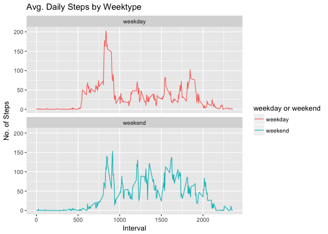

# Reproducible research: Course project 1 - Activity data
Brent O'Carrigan  
5/3/2017  

It is now possible to collect a large amount of data about personal movement using activity monitoring devices such as a [Fitbit](http:\\www.fitbit.com), [Nike Fuelband](http://www.nike.com/us/en_us/c/nikeplus-fuelband), or [Jawbone Up](https://jawbone.com/up). These type of devices are part of the “quantified self” movement – a group of enthusiasts who take measurements about themselves regularly to improve their health, to find patterns in their behavior, or because they are tech geeks. But these data remain under-utilized both because the raw data are hard to obtain and there is a lack of statistical methods and software for processing and interpreting the data.

This assignment makes use of data from a personal activity monitoring device. This device collects data at 5 minute intervals through out the day. The data consists of two months of data from an anonymous individual collected during the months of October and November, 2012 and include the number of steps taken in 5 minute intervals each day.

The data for this assignment can be downloaded from the course web site:

Dataset: [Activity monitoring data](https://d396qusza40orc.cloudfront.net/repdata%2Fdata%2Factivity.zip) [52K]
The variables included in this dataset are:

* steps: Number of steps taking in a 5-minute interval (missing values are coded as 𝙽𝙰)
* date: The date on which the measurement was taken in YYYY-MM-DD format
* interval: Identifier for the 5-minute interval in which measurement was taken

The dataset is stored in a comma-separated-value (CSV) file and there are a total of 17,568 observations in this dataset.

## Load and process the data


```r
library(data.table)
library(ggplot2)

# Read csv into data.table
setwd("~/data_science/Coursera/Reproducible_research")
activityDT <- data.table::fread('activity.csv')
```

## What is the mean total number of steps taken per day?
For this part of the assignment, you can ignore the missing values in the dataset.

1. Calculate the total number of steps taken per day


```r
# Create a new data table with new variable 'steps' sum total steps by day
Total_Steps <- activityDT[, c(lapply(.SD, sum, na.rm = FALSE)), .SDcols = c("steps"), by = .(date)] 

head(Total_Steps, 10)
```

```
##           date steps
##  1: 2012-10-01    NA
##  2: 2012-10-02   126
##  3: 2012-10-03 11352
##  4: 2012-10-04 12116
##  5: 2012-10-05 13294
##  6: 2012-10-06 15420
##  7: 2012-10-07 11015
##  8: 2012-10-08    NA
##  9: 2012-10-09 12811
## 10: 2012-10-10  9900
```

2. If you do not understand the difference between a histogram and a barplot, research the difference between them. Make a histogram of the total number of steps taken each day


```r
ggplot(Total_Steps, aes(x = steps)) +
    geom_histogram(fill = "blue", binwidth = 1000) +
    labs(title = "Total Number of Steps per Day", x = "Steps per day", y = "Frequency")
```

<!-- -->


3. Calculate and report the mean and median of the total number of steps taken per day

```r
Total_Steps[, .(Mean_Steps = mean(steps, na.rm = TRUE), Median_Steps = median(steps, na.rm = TRUE))]
```

```
##    Mean_Steps Median_Steps
## 1:   10766.19        10765
```

## What is the average daily activity pattern?
1. Make a time series plot (i.e. 𝚝𝚢𝚙𝚎 = "𝚕") of the 5-minute interval (x-axis) and the average number of steps taken, averaged across all days (y-axis)

```r
# Create a new data table of mean number of steps by interval, exclude missing values
IntervalDT <- activityDT[, c(lapply(.SD, mean, na.rm = TRUE)), .SDcols = c("steps"), by = .(interval)] 

# Line plot of mean number of steps per day by interval
ggplot(IntervalDT, aes(x = interval , y = steps)) + geom_line(color="blue", size=1) + labs(title = "Average Number Daily Steps per Interval Across All Days", x = "Interval", y = "Avg. Steps per day")
```

<!-- -->


2. Which 5-minute interval, on average across all the days in the dataset, contains the maximum number of steps?

```r
max_steps <- IntervalDT[steps == max(steps), .(max_interval = interval)]
print(max_steps)
```

```
##    max_interval
## 1:          835
```
Interval 835 contains the maximum number of steps, on average across all days

## Imputing missing values

Note that there are a number of days/intervals where there are missing values (coded as 𝙽𝙰). The presence of missing days may introduce bias into some calculations or summaries of the data.

1. Calculate and report the total number of missing values in the dataset (i.e. the total number of rows with 𝙽𝙰s)


```r
activityDT[is.na(steps), .N ]
```

```
## [1] 2304
```


2. Devise a strategy for filling in all of the missing values in the dataset. The strategy does not need to be sophisticated. For example, you could use the mean/median for that day, or the mean for that 5-minute interval, etc.


```r
# Filling in missing values with mean of dataset. 
activityDT[is.na(steps), "steps"] <- activityDT[, c(lapply(.SD, mean, na.rm = TRUE)), .SDcols = c("steps")]
```

```
## Warning in `[<-.data.table`(`*tmp*`, is.na(steps), "steps", value =
## structure(list(: Coerced 'double' RHS to 'integer' to match the column's
## type; may have truncated precision. Either change the target column to
## 'double' first (by creating a new 'double' vector length 17568 (nrows of
## entire table) and assign that; i.e. 'replace' column), or coerce RHS to
## 'integer' (e.g. 1L, NA_[real|integer]_, as.*, etc) to make your intent
## clear and for speed. Or, set the column type correctly up front when you
## create the table and stick to it, please.
```

3. Create a new dataset that is equal to the original dataset but with the missing data filled in.


```r
data.table::fwrite(x = activityDT, file = "tidyData.csv", quote = FALSE)
```


4 Make a histogram of the total number of steps taken each day and Calculate and report the mean and median total number of steps taken per day. Do these values differ from the estimates from the first part of the assignment? What is the impact of imputing missing data on the estimates of the total daily number of steps?


```r
# Total number of steps per day
Total_Steps <- activityDT[, c(lapply(.SD, sum)), .SDcols = c("steps"), by = .(date)] 

# Mean and median total number of steps per day
Total_Steps[, .(Mean_Steps = mean(steps), Median_Steps = median(steps))]
```

```
##    Mean_Steps Median_Steps
## 1:   10751.74        10656
```

```r
# Histogram number of steps per day
ggplot(Total_Steps, aes(x = steps)) +
        geom_histogram(fill = "blue", binwidth = 1000) +
        labs(title = "Daily Steps", x = "Steps", y = "Frequency")
```

<!-- -->
## Are there differences in activity patterns between weekdays and weekends?

For this part the `weekdays()` function may be of some help here. Use the dataset with the filled-in missing values for this part.

1. Create a new factor variable in the dataset with two levels – “weekday” and “weekend” indicating whether a given date is a weekday or weekend day.

```r
# Just recreating activityDT from scratch then making the new factor variable. (No need to, just want to be clear on what the entire process is.) 
activityDT <- data.table::fread('activity.csv')
activityDT[, date := as.POSIXct(date, format = "%Y-%m-%d")]
```

```
##        steps       date interval
##     1:    NA 2012-10-01        0
##     2:    NA 2012-10-01        5
##     3:    NA 2012-10-01       10
##     4:    NA 2012-10-01       15
##     5:    NA 2012-10-01       20
##    ---                          
## 17564:    NA 2012-11-30     2335
## 17565:    NA 2012-11-30     2340
## 17566:    NA 2012-11-30     2345
## 17567:    NA 2012-11-30     2350
## 17568:    NA 2012-11-30     2355
```

```r
activityDT[, `Day of Week`:= weekdays(x = date)]
```

```
##        steps       date interval Day of Week
##     1:    NA 2012-10-01        0      Monday
##     2:    NA 2012-10-01        5      Monday
##     3:    NA 2012-10-01       10      Monday
##     4:    NA 2012-10-01       15      Monday
##     5:    NA 2012-10-01       20      Monday
##    ---                                      
## 17564:    NA 2012-11-30     2335      Friday
## 17565:    NA 2012-11-30     2340      Friday
## 17566:    NA 2012-11-30     2345      Friday
## 17567:    NA 2012-11-30     2350      Friday
## 17568:    NA 2012-11-30     2355      Friday
```

```r
activityDT[grepl(pattern = "Monday|Tuesday|Wednesday|Thursday|Friday", x = `Day of Week`), "weekday or weekend"] <- "weekday"
activityDT[grepl(pattern = "Saturday|Sunday", x = `Day of Week`), "weekday or weekend"] <- "weekend"
activityDT[, `weekday or weekend` := as.factor(`weekday or weekend`)]
```

```
##        steps       date interval Day of Week weekday or weekend
##     1:    NA 2012-10-01        0      Monday            weekday
##     2:    NA 2012-10-01        5      Monday            weekday
##     3:    NA 2012-10-01       10      Monday            weekday
##     4:    NA 2012-10-01       15      Monday            weekday
##     5:    NA 2012-10-01       20      Monday            weekday
##    ---                                                         
## 17564:    NA 2012-11-30     2335      Friday            weekday
## 17565:    NA 2012-11-30     2340      Friday            weekday
## 17566:    NA 2012-11-30     2345      Friday            weekday
## 17567:    NA 2012-11-30     2350      Friday            weekday
## 17568:    NA 2012-11-30     2355      Friday            weekday
```

```r
head(activityDT)
```

```
##    steps       date interval Day of Week weekday or weekend
## 1:    NA 2012-10-01        0      Monday            weekday
## 2:    NA 2012-10-01        5      Monday            weekday
## 3:    NA 2012-10-01       10      Monday            weekday
## 4:    NA 2012-10-01       15      Monday            weekday
## 5:    NA 2012-10-01       20      Monday            weekday
## 6:    NA 2012-10-01       25      Monday            weekday
```

2. Make a panel plot containing a time series plot (i.e. 𝚝𝚢𝚙𝚎 = "𝚕") of the 5-minute interval (x-axis) and the average number of steps taken, averaged across all weekday days or weekend days (y-axis). See the README file in the GitHub repository to see an example of what this plot should look like using simulated data.

```r
activityDT[is.na(steps), "steps"] <- activityDT[, c(lapply(.SD, median, na.rm = TRUE)), .SDcols = c("steps")]
IntervalDT <- activityDT[, c(lapply(.SD, mean, na.rm = TRUE)), .SDcols = c("steps"), by = .(interval, `weekday or weekend`)] 

ggplot(IntervalDT , aes(x = interval , y = steps, color=`weekday or weekend`)) + geom_line() + labs(title = "Avg. Daily Steps by Weektype", x = "Interval", y = "No. of Steps") + facet_wrap(~`weekday or weekend` , ncol = 1, nrow=2)
```

<!-- -->

